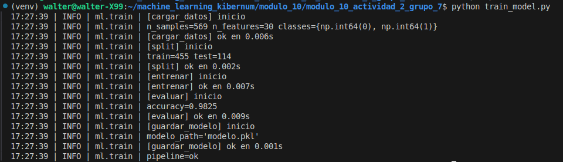
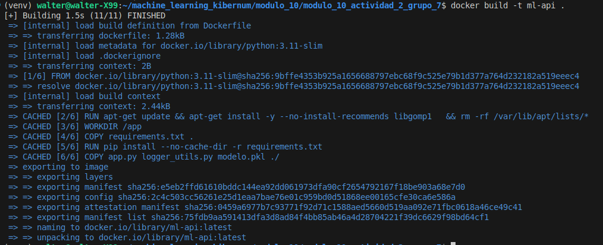
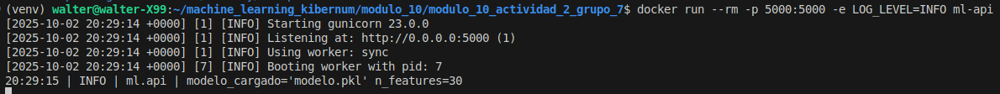
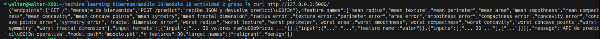
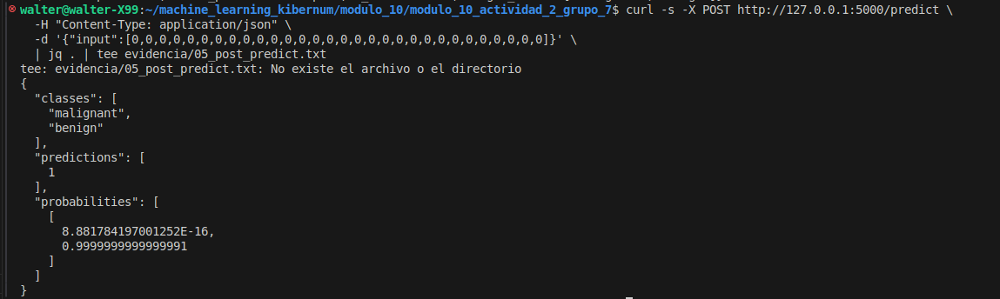

# Actividad Módulo 10 · Sesión 2
**Contenerización de una API ML con Docker**

Modelo: Regresión Logística sobre *Breast Cancer* (`scikit-learn`).  
API: Flask servida con Gunicorn.  
Entrega: código, imagen Docker y pruebas con `curl`.

---

## 📁 Estructura
```
.
├─ app.py
├─ train_model.py
├─ logger_utils.py
├─ modelo.pkl
├─ requirements.txt
├─ Dockerfile
├─ README.md
├─ logs/              # opcional, no subir
├─ venv/              # opcional, no subir
└─ __pycache__/       # no subir
```

---

## ⚙️ Requisitos
- Python 3.11+ (para entrenar local)
- Docker (para construir/ejecutar la API)

---

## 🚀 Entrenamiento local
```bash
python -m venv venv
source venv/bin/activate          # Linux/Mac
.env\Scriptsctivate           # Windows

pip install -r requirements.txt
python train_model.py             # genera modelo.pkl
```

> Evidencia:  
> 

---

## 🐳 Construcción de la imagen
```bash
docker build -t ml-api .
```

> Evidencia:  
> 

---

## ▶️ Ejecución del contenedor
```bash
docker run --rm -p 5000:5000 -e LOG_LEVEL=INFO ml-api
```

> Evidencia:  
> 

---

## 🔎 Pruebas de la API
### 1) Bienvenida y metadatos
```bash
curl http://127.0.0.1:5000/
```

> Evidencia:  
> 

### 2) Predicción
```bash
curl -s -X POST http://127.0.0.1:5000/predict   -H "Content-Type: application/json"   -d '{"input":[0,0,0,0,0,0,0,0,0,0,0,0,0,0,0,0,0,0,0,0,0,0,0,0,0,0,0,0,0,0]}'
```

Respuesta esperada:
```json
{
  "classes": ["malignant", "benign"],
  "predictions": [1],
  "probabilities": [[..., ...]]
}
```

> Evidencia:  
> 

---

## 📌 Notas
- No versionar `venv/`, `logs/` ni `__pycache__/`. Usa `.gitignore`.
- En contenedor se usa Gunicorn.
- Puedes mapear logs al host:
  ```bash
  docker run --rm -p 5000:5000 -e LOG_LEVEL=INFO -v "$PWD/logs:/app/logs" ml-api
  ```

---

## ✅ Checklist de entrega
- [ ] `train_model.py`, `app.py`, `logger_utils.py`
- [ ] `modelo.pkl`, `requirements.txt`, `Dockerfile`, `README.md`
- [ ] Capturas: entrenamiento, build, run, GET `/`, POST `/predict`
